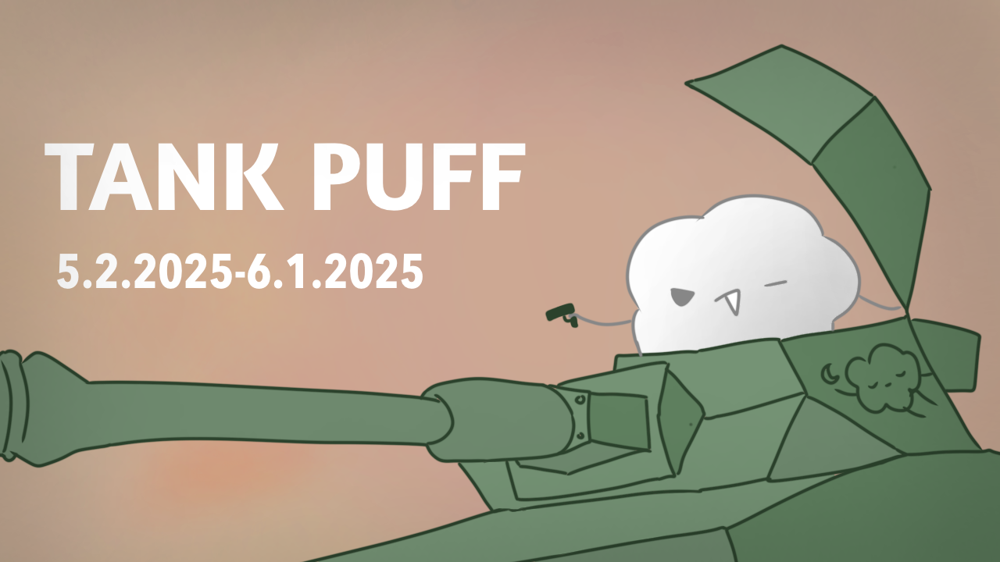

# Strawberry Puff Bot

Strawberry Puff Bot is a Discord gacha bot designed to enhance your server experience with fun and interactive rolling features for cute doodles (puffs).

## Current Banner



## Features

- Roll random puffs with varying rarities
- Track your roll statistics
- View drop rates for each puff
- Compare your rolls with other users
- Customizable settings
- And more!

## Bot Info

This bot is live and is available for you to add to your Discord server whenever you want!

### Bot Install Links

- [User Install](https://discord.com/oauth2/authorize?client_id=1338650603617910817&integration_type=1&scope=applications.commands)

- [Guild (Server) Install](https://discord.com/oauth2/authorize?client_id=1338650603617910817&permissions=277025507328&integration_type=0&scope=bot)

- [New All Purpose Link](https://discord.com/oauth2/authorize?client_id=1338650603617910817)

The bot's discord username is `Strawberry Puff Bot#3856` and its App ID is `1338650603617910817`. Please use this if you need help verifying my bot. Also on the bot's profile the "Copy Link" option links to the Guild Install link provided above.

By the way, currently I don't have the capabilities to have the bot running 24/7, so expect there to be lots of downtime for bot usage. Although. there happens to be a setting that pings you on startup if you're worrying about when you can play with the bot. Other then that, have fun playing with this passion project I made and make sure to thank @orchadork for the drawings!!!

---

## Installation

Please ensure your Python version is 3.6.X and greater[^1]. The code will not run on any earlier version of Python.

1. Clone the repository:

    ```bash
    git clone https://github.com/TurtleGod7/Strawberry-Puff-Bot.git
    ```

2. Navigate to the project directory:

    ```bash
    cd Strawberry-Puff-Bot
    ```

3. Install the dependencies:

    ```bash
    python -m pip install -r requirements.txt
    ```

    - Preferably make this in a venv named `.venv`[^2]

## Usage

1. Create a `.env` file in the root directory of the repository and add your Discord bot token[^3] and Admin users:

    ```env
    DISCORD_TOKEN=your_token_here
    ADMIN_USERS=discord_user_id_1,discord_user_id_2,etc.
    ```

2. Change Flags (Optional)

    Change personal information about your repository in `main.py` in the `### Control Variables` section at the top[^4] and change TABLE_CREATION variable to True if you want to wipe the previous data[^5]

    ```python
    TABLE_CREATION = True
    GIT_USERNAME = "Your_Github_Username"
    GIT_REPO = "Your_Github_Repository_Name"
    ```

3. Start the bot:

    ```bash
    python main.py
    ```

## Project Structure

The repository is organized as follows:

```bash
Strawberry-Puff-Bot/
├── assets/
│   ├── database/
│   │   ├── puffs.db # DB for puffs
│   │   └── users.db # DB for user data
│   ├── profile/ # Where banners are stored
│   ├── puffs/ # Where puff .pngs are stored
│   └── tables/
├── src/
│   ├── main.py # Main script
│   └── helpers/
│       ├── battlefunctions.py # Functions for pvp
│       ├── daemons.py # Daemons
│       ├── errorclasses.py # Classes for errors
│       └── flags.py # Flags used in main script
├── .env.example # Used for secrets (You need to make your own)
├── requirements.txt
├── README.md
└── LICENSE
```

## Contributing

Contributions are welcome! Please fork the repository and create a pull request with your changes. I'm also working on a website for the bot and I would love for some support on that.

## License

This project is licensed under the GNU General Public License. See the [LICENSE](LICENSE) file for details.

## Contact

For any questions or suggestions, please open an issue or contact me.

## Credit

The code was written by @TurtleGod7 and the puffs were drawn and created by @orchadork.

[^1]: I've only tested this code on python 3.9.6 on my Mac but in theory it should work on 3.7.X and greater.

[^2]: If you need help creating a venv, I've found [this](https://packaging.python.org/en/latest/guides/installing-using-pip-and-virtual-environments/) to be useful when I first set it up.

[^3]: If you need help with retrieving your bot's token, refer to this [Github Wiki Page](https://github.com/reactiflux/discord-irc/wiki/creating-a-discord-bot-&-getting-a-token) for more information

[^4]: This is optional due to the images being referenced from the online repository. Do note that when you make changes like adding new images, they will only show up on Discord if your images have been pushed to GitHub. So please change these strings only if you change images

[^5]: If you want to wipe any data, make sure you create two databases at these file paths (relative):
    assets/database/puffs.db (HIGHLY UNRECOMMEND TO WIPE)
    assets/database/users.db
